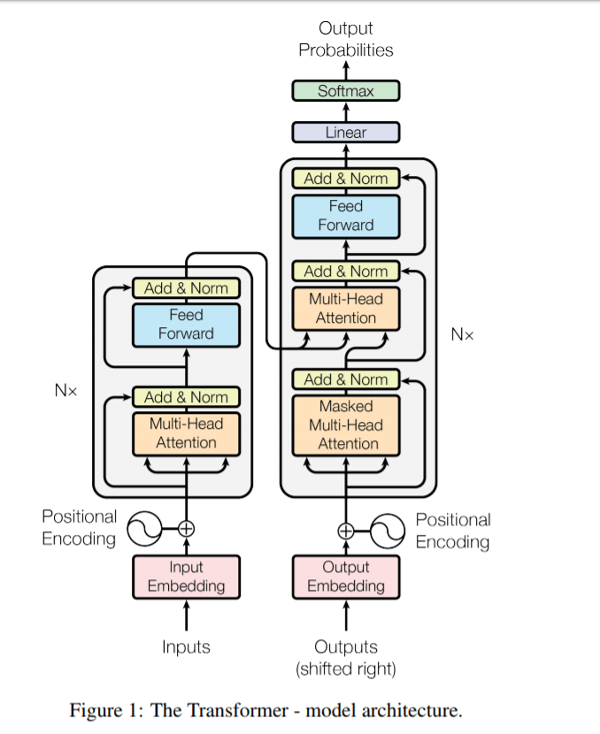

# ElonTweetNet

ElonTweetNet is a minimalist and easy-to-use implementation of a simplified Transformer architecture, tailored for generating short tweets mimicking Elon Musk's unique style. The model seeks to illustrate the underlying principles behind the transformer architecture with an intriguing dataset.

## Files
* elon_musk_tweets.csv - the dataset of tweets
* musk_tweet_generator.py - the Python code for the model's generation and training + validation
* log.txt - the log of the model's training and validation process (mine was run on Azure Cloud ML)

## Model Architecture

The model is based on the Transformer architecture, as described in the paper ["Attention is All You Need"](https://arxiv.org/abs/1706.03762) by Vaswani et al. The Transformer model is a type of neural network architecture that relies solely on self-attention mechanisms and dispenses with recurrence and convolutions entirely.

Here is a simplified diagram of the Transformer architecture (exclude the left / encoder side for this implementation):

In addition to the Transformer architecture, the model also incorporates ResNet connections, which help to alleviate the problem of vanishing gradients in deep neural networks.

## Dataset

The model is trained on the [Elon Musk Tweet dataset](https://www.kaggle.com/datasets/gpreda/elon-musk-tweets) available on Kaggle. This dataset contains over 6,000 of Elon Musk's tweets, providing a rich source of text for the model to learn from.

## Inspiration

This project is inspired by Andrej Karpathy's implementation of character-level language models, as explained in his [lecture](https://www.youtube.com/watch?v=kCc8FmEb1nY&t=6052s).

